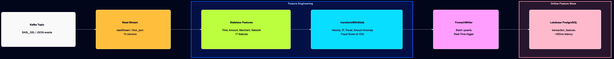
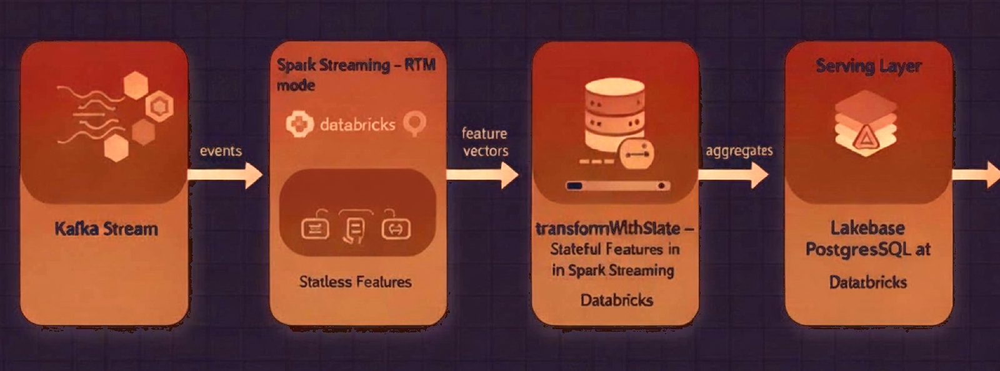

# Real-Time Streaming Fraud Feature Engineering with Lakebase

Credit card fraud costs over **$30 billion annually**, and the window to detect it is measured in milliseconds. Traditional batch pipelines make fraud signals stale before they reach a model. This project demonstrates how to close that gap using **Spark Structured Streaming Real-Time Mode** and **Databricks Lakebase** to compute and serve fraud detection features with sub-second latency.



## Key Technologies

- **[Real-Time Mode (RTM)](https://www.databricks.com/blog/introducing-real-time-mode-apache-sparktm-structured-streaming)** -- Continuous, sub-second processing that eliminates micro-batch scheduling overhead
- **[`transformWithState`](https://spark.apache.org/docs/latest/structured-streaming-programming-guide.html)** (Spark 4.0+) -- Fine-grained per-key state management with TTL-based expiration and RocksDB-backed persistence
- **[Databricks Lakebase](https://docs.databricks.com/en/lakebase/index.html)** -- Managed PostgreSQL for low-latency feature serving

## Pipeline Overview



**Stateless features** (computed per-row): time patterns, amount analysis, merchant risk scores, location risk, device/network signals.

**Stateful features** (per-user state via `transformWithState`): transaction velocity (10-min/1-hour windows), IP change detection, impossible travel detection (>800 km/h), rolling amount z-scores, and a composite fraud score (0-100).

## Prerequisites

- **Databricks Runtime 17.3+** (Spark 4.0+)
- Cluster configured for [Real-Time Streaming](https://docs.databricks.com/aws/en/structured-streaming/real-time#cluster-configuration)
- **Databricks Python SDK >= 0.65.0**
- **dbldatagen** library installed on the cluster
- Access to a **Lakebase PostgreSQL** instance
- Kafka topic with SASL_SSL credentials stored in [Databricks Secrets](https://docs.databricks.com/aws/en/security/secrets/)

## Run Order

Run the notebooks sequentially -- each one contains detailed setup instructions:

| # | Notebook | Description |
|---|----------|-------------|
| 1 | `00_setup.ipynb` | Validate prerequisites, connect to Lakebase, create the `transaction_features` table (run once, idempotent) |
| 2 | `01_generate_streaming_data.ipynb` | Generate synthetic credit card transactions with `dbldatagen` and publish to Kafka |
| 3 | `02_streaming_fraud_detection_pipeline.ipynb` | Read from Kafka, compute stateless + stateful features, write enriched features to Lakebase (~400ms e2e latency) |

## Project Structure

```
.
├── 00_setup.ipynb                              # Lakebase connection & table creation
├── 01_generate_streaming_data.ipynb            # Synthetic data generator → Kafka
├── 02_streaming_fraud_detection_pipeline.ipynb  # Feature engineering pipeline
├── utils/
│   ├── config.py                               # Kafka, Lakebase, and data-gen configuration
│   ├── data_generator.py                       # dbldatagen-based transaction generator
│   ├── feature_engineering.py                  # Stateless & stateful feature logic
│   └── lakebase_client.py                      # Lakebase PostgreSQL client & ForeachWriter
└── images/                                     # Architecture diagrams used in notebooks
```

## Configuration

All pipeline settings are centralized in `utils/config.py`:

- **Kafka**: topic name, secret scope, checkpoint paths
- **Lakebase**: instance name, database name
- **Data generation**: number of users, merchants, rows per second
